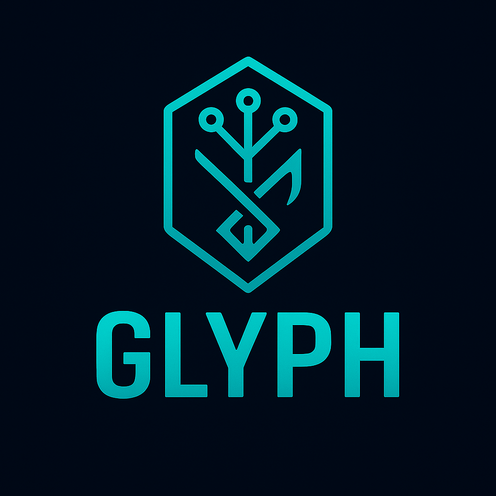

# Glyph

<div align="center">
  

  **Enterprise-grade Rust library for Model Context Protocol (MCP)**

  
  
  
  
  
  
  
  
</div>

## DISCLAIMER

⚠️ **EXPERIMENTAL LIBRARY - FOR LAB/PERSONAL USE** ⚠️

This is an experimental library under active development. It is intended for research, learning, and personal projects. The API is subject to change!

**Glyph** is the Rust backbone for MCP in your stack—**server + client + transports + schemas**—built for high throughput and deep observability. Ideal for **GhostLLM**, **GhostFlow**, **Jarvis**, and service backends.

- 🧠 **Full MCP stack**: types, JSON-RPC, capabilities, sessions
- 🛰️ **Transports**: stdio, WebSocket, HTTP/1.1, HTTP/2 (h3 optional)
- 🔐 **Consent/Audit**: policy gates + signed audit log hooks
- 📜 **OpenAPI/JSON-Schema**: first-class tool and resource schemas
- 📈 **Prod-ready**: tokio, tracing, metrics, robust error model
- 🔗 **Interop**: clean FFI surface for Zig (Rune) and other languages

---

## Add to your project

**Cargo.toml**
```toml
[dependencies]
glyph = { git = "https://github.com/ghostkellz/glyph", tag = "v0.1.0" }
# or path/crates.io when published
tokio = { version = "1", features = ["full"] }
serde = { version = "1", features = ["derive"] }
tracing = "0.1"
```

## Quick Start — Client

```rust
use glyph::client::Client;

#[tokio::main]
async fn main() -> anyhow::Result<()> {
    let client = Client::connect_ws("wss://localhost:7331").await?;
    let out = client.tool("read_file")
        .invoke(serde_json::json!({ "path": "/etc/hosts" }))
        .await?;
    println!("{}", out);
    Ok(())
}
```

## Quick Start — Server Tool

```rust
use glyph::{server::{Server, Tool, ToolCtx, ToolResult}, json};

#[derive(serde::Deserialize)]
struct ReadFileInput { path: String }

struct ReadFile;

#[glyph::async_trait]
impl Tool for ReadFile {
    fn name(&self) -> &'static str { "read_file" }
    async fn call(&self, ctx: &ToolCtx, input: json::Value) -> ToolResult<json::Value> {
        ctx.guard.require("fs.read")?; // optional consent policy
        let args: ReadFileInput = serde_json::from_value(input)?;
        let data = tokio::fs::read_to_string(args.path).await?;
        Ok(json::json!({ "contents": data }))
    }
}

#[tokio::main]
async fn main() -> anyhow::Result<()> {
    let mut srv = Server::builder().transport_stdio().build().await?;
    srv.register(ReadFile);
    srv.run().await
}
```

## Quick Start — Server Binary

The Glyph MCP server binary provides a ready-to-use MCP server with built-in tools.

### Installation

```bash
# Clone the repository
git clone https://github.com/ghostkellz/glyph
cd glyph

# Build the server binary
cargo build --release
```

### Running the Server

```bash
# Start WebSocket server (default)
./target/release/glyph serve

# Start stdio server
./target/release/glyph serve --transport stdio

# Custom address and port
./target/release/glyph serve --address 0.0.0.0:8080

# Enable verbose logging
./target/release/glyph serve --verbose
```

### Available Tools

The server comes with 7 built-in tools:

- **echo**: Echo back input messages
- **read_file**: Read file contents
- **write_file**: Write content to files
- **list_directory**: List directory contents
- **delete_file**: Delete files or directories
- **shell_execute**: Execute shell commands
- **http_request**: Make HTTP requests to external APIs

### Testing the Server

```bash
# Build and run the test client
cargo build --example test_client
./target/debug/examples/test_client
```

### Docker Deployment

```dockerfile
FROM rust:1.75-slim as builder
WORKDIR /app
COPY . .
RUN cargo build --release

FROM debian:bookworm-slim
RUN apt-get update && apt-get install -y ca-certificates && rm -rf /var/lib/apt/lists/*
COPY --from=builder /app/target/release/glyph /usr/local/bin/glyph
EXPOSE 7331
CMD ["glyph", "serve", "--address", "0.0.0.0:7331"]
```

## Features

- **Transports**: stdio, ws, http, optional h3
- **Security**: policy engine hooks (GhostGuard-style), redaction, audit
- **Observability**: tracing, Prometheus metrics, request IDs
- **Schemas**: derive-macros for tools/resources from OpenAPI/JSON-Schema
- **Interop**: glyph-ffi for C ABI → Zig (Rune) can link directly

## Integration Targets

- **[GhostLLM](https://github.com/ghostkellz/ghostllm)**: expose provider tools via MCP; route requests safely
- **[GhostFlow](https://github.com/ghostkellz/ghostflow)**: call MCP tools as nodes; publish flows as MCP tools
- **[Jarvis](https://github.com/ghostkellz/jarvis)**: local ai agent, arch system agent, blockchain agent
- **[Zeke](https://github.com/ghostkellz/zeke)**: local tool host with consent prompts
- **zeke.nvim**: Claude-Code.nvim like plugin for zeke AI systems
- **Wraith/gDNS**: admin operations exposed as audited tools
